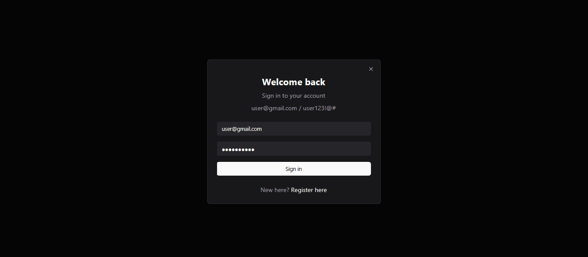
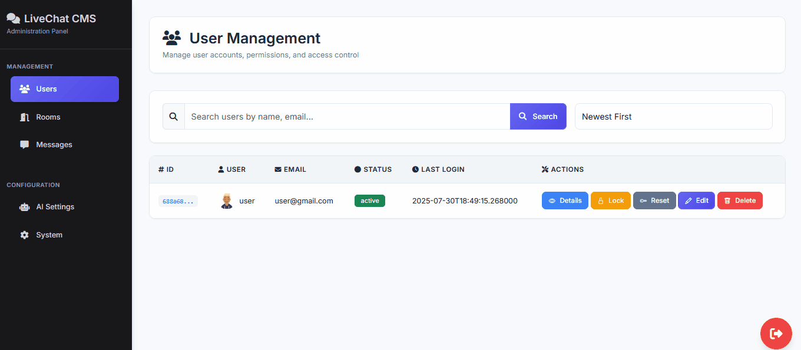

# 📁 Live‑Chat Service

[](#)
[](#)

[](#)
[](#)


**Built by Devency Agency**
A **source‑available** FastAPI + Socket.IO real‑time chat application. Core event logic and sensitive implementation details have been redacted from this public repo.


## 🔑 Features

* **JWT‑protected** REST endpoints for authentication & user management
* **Real‑time messaging** via WebSocket (Socket.IO) with room‑based channels
* **Room CRUD**: create, join, leave, ban, ownership checks
* **User CRUD**: profile, email/password updates, admin utilities
* **AI assistant integration** usage logic hidden
* **Rate limiting** (per‑user cooldown) on chat events
* **Configurable** settings via database
* **Next.js front‑end** served statically (build output in `/out`)


## 🚀 Live Demo

> *This project is for code review only; public demo at **https://livechat.demo.devency.net**.*  
>  Admin panel available at 👉 **https://livechat.demo.devency.net/admin/dashboard** (email: user@gmail.com, password: user123!@#)  
> Interested in running a local instance? Contact us at **info@devency.net**.  
> ⚠️ *Note: This is a demo deployment. You may encounter minor issues with AI responses or site functionality as ongoing improvements are being tested.*
 

> Main Interface


> Admin Panel


## 📖 Usage / Examples

### 1. Authenticate

#### Register

```http
POST /api/auth/register
Content-Type: application/json

{
  "email":    "alice@example.com",
  "username": "alice_w",
  "password": "S3cureP@ss!"
}
```

**Response:**

```json
{ "access_token": "<JWT_TOKEN>" }
```

#### Login

```http
POST /api/auth/login
Content-Type: application/json

{
  "email":    "alice@example.com",
  "password": "S3cureP@ss!"
}
```

**Response:**

```json
{ "access_token": "<JWT_TOKEN>" }
```

---

### 2. REST API Endpoints

| Route                  | Method | Description                                |
| :--------------------- | :----- | :----------------------------------------- |
| `/api/users/me`        | GET    | Fetch current user profile                 |
| `/api/users/me`        | PATCH  | Update email/password/profile picture      |
| `/api/rooms`           | POST   | Create a new room                          |
| `/api/rooms`           | GET    | List all rooms you belong to               |
| `/api/rooms/{room_id}` | GET    | Get room details (members count, metadata) |
| `/admin/users`         | GET    | (Admin) Paginated user list                |
| `/admin/rooms`         | GET    | (Admin) Paginated room list                |

> **Note:** The table above covers only the most commonly used endpoints. There are additional routes—particularly admin‑level operations (delete user/room, lock/unlock, stats, AI settings, message moderation, etc.)—that require an admin JWT and whose implementations are stubbed in core modules.


### 3. WebSocket Events (Socket.IO)

Connect using your JWT:

```js
const socket = io("/ws", {
  auth: { token: "<JWT_TOKEN>" }
});
```

| Event        | Payload                                | Description                                                                       |
| :----------- | :------------------------------------- | :-------------------------------------------------------------------------------- |
| `connect`    | `{ token }`                            | Authenticate connection; on error, server emits `error` and disconnects.          |
| `join`       | `{ room_uuid: "<roomId>" }`            | Leaves previous rooms, checks membership via `Users.is_user_in_room`, then joins. |
| `message`    | `{ room_uuid, message, is_ai (bool) }` | Validates length & rate limits; persists message; broadcasts to room; AI stubbed. |
| `disconnect` | —                                      | Cleans up internal `sid→user` mapping.                                            |

> The actual event handler implementations have been removed (`NotImplementedError`) but the pseudo‑workflow is documented inline in comments.


## 📂 Folder Structure

```text
.
├── server.py               # FastAPI app + Socket.IO wiring (stubs for events)
├── routers/                # API routers: auth, users, rooms, admin (public logic)
├── core.py                 # Models & stubs for Users, Rooms, Admin, AI, config getters
├── out/                    # Next.js build output (static front‑end)
├── README.md               # This file
└── requirements.txt        # Python dependencies
```

---

## 📜 Core Logic Hidden

Many sensitive or proprietary parts are intentionally stubbed:

* **`create_access_token`** (JWT signing logic)
* **Database URI & secret fetching** (`get_db_uri`, `get_config`)
* **AI integration** (`AI.ask_deepseek`, billing/stats updates)
* **Socket.IO event bodies** (connect/join/message/disconnect workflows)

Readers see the full architectural surface—data flows, validation rules, class/API contracts—without exposing secret keys or business‑critical implementations.


## 🤝 Contributing

This repo is **source‑available** for review and feedback.

* **Stubs** exist in core modules—pull requests affecting business logic will not be merged here.
* For feature requests or discussions, please open an issue.


## 📜 License

This repository is **source‑available** under the MIT License.
Core security‑sensitive modules and the live deployment config remain proprietary. See [`LICENSE`](./LICENSE) for details.


## 📫 Private Access & Licensing

Interested in the full, runnable codebase—including AI logic, admin panel, CI/CD, and full tests?
Email us at **[info@devency.net](mailto:info@devency.net)** for private repo access or licensing options.


## 🛣️ Roadmap

* [ ] Role‑based admin dashboard (private)
* [ ] End‑to‑end tests & CI/CD integration
* [ ] Enhanced AI context‑memory features


## 👤 Authors

**Devency Agency**  
🌐 [https://devency.net](https://devency.net)  
✉️ [info@devency.net](mailto:info@devency.net)  

## 🏷️ Badges


*Thank you for exploring our source‑available project!* 🚀
